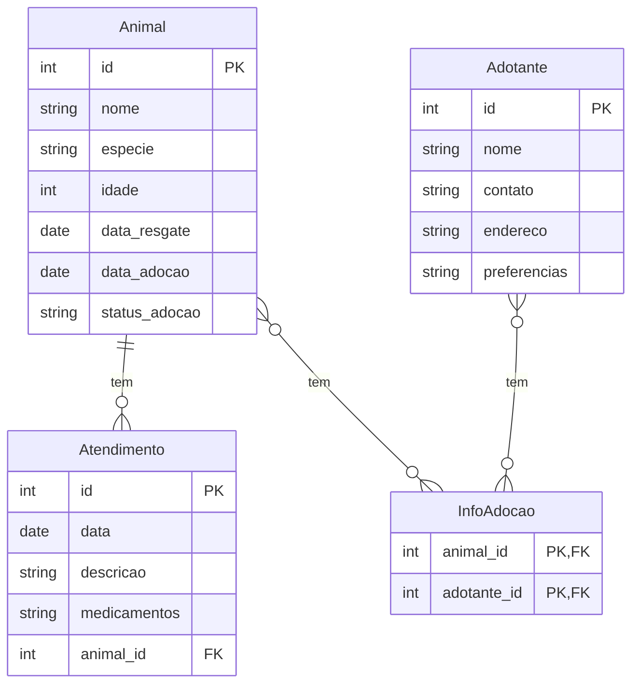

```mermaid
erDiagram
    Animal {
        int id PK
        string nome
        string especie
        int idade
        date data_resgate
        date data_adocao
        string status_adocao
    }
    Atendimento {
        int id PK
        date data
        string descricao
        string medicamentos
        int animal_id FK
    }
    Adotante {
        int id PK
        string nome
        string contato
        string endereco
        string preferencias
    }
    InfoAdocao {
        int animal_id PK, FK
        int adotante_id PK, FK
    }
    Animal ||--o{ Atendimento : "tem"
    Animal }o--o{ InfoAdocao : "tem"
    Adotante }o--o{ InfoAdocao : "tem"

```
