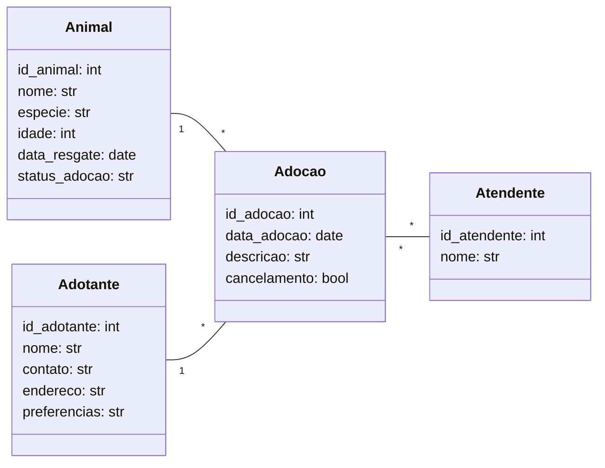
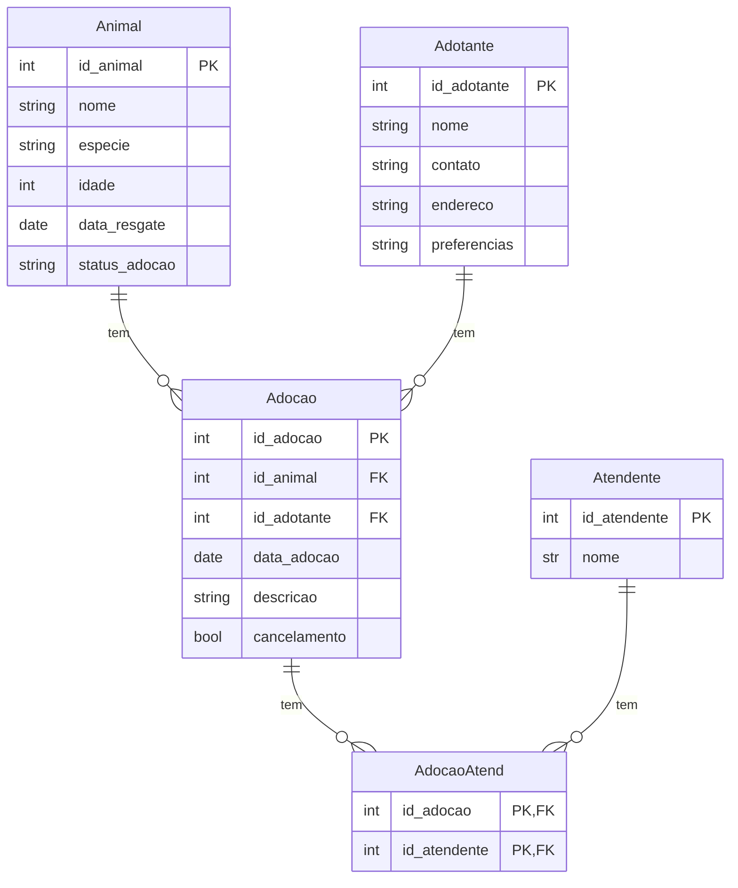

Este projeto implementa uma API REST para gerenciamento de um sistema de adoção de animais, utilizando FastAPI, SQLModel, Alembic e SQLite/PostgreSQL (local e na nuvem usando o supabase).

# Diagrama de Classe:


# Diagrama ER:

PS: A tabela AdocaoAtend é uma tabela associativa, necessária para representar o relacionamento muitos-para-muitos entre Adocao e Atendente.


# Consultas Planejadas
### a) Consultas por ID
- Buscar Animal por ID  
- Buscar Adotante por ID  
- Buscar Adoção por ID  
- Buscar Atendente por ID  

### b) Listagens filtradas por relacionamentos
- Listar todos os animais adotados por um adotante  
- Listar todas as adoções de um animal  
- Listar todas as adoções de um atendente  

### c) Buscas por texto parcial
- Buscar animais pelo nome (contém texto)  
- Buscar adotantes pelo nome  
- Buscar atendente pelo nome  
- Buscar adoções pela espécie  
- Buscar adoções pelo status de cancelamento  

### d) Filtros por data / ano
- Adoções realizadas em determinado ano  
- Animais resgatados em determinado ano  

### e) Agregações e contagens
- Quantidade total de animais cadastrados  

### f) Classificações e ordenações
- Listar animais por idade (do mais novo ao mais velho)  

### g) Consultas complexas envolvendo múltiplas entidades
- Listar animais com `status_adocao = 1`, exibindo:
  - Nome do animal  
  - ID do animal  
  - Nome do adotante  
  - ID do adotante  
  - Data da adoção  
  - Nome(s) do(s) atendente(s)  
  - ID(s) do(s) atendente(s)
  ps: as consultas foram implementadas diretamente nas rotas da API, organizadas por entidade, utilizando SQLModel e SQLAlchemy para operações de filtragem, ordenação, agregação e junções entre tabelas.

# Estrutura/Pastas do código: 
```txt
trab2_persistencia_2025/
├── README.md                    #descrição do projeto
├── .venv/                       #ambiente virtual criado pelo uv
├── pyproject.toml               #metadados e dependências do projeto (uv)
├── uv.lock                      #lockfile com versões exatas das dependências
├── .python-version              #versão do Python usado no projeto
|
├── alembic.ini                  #configuração principal do Alembic (onde estão as migrações, como conectar ao banco). Lê a URL do .env
├── .env                         #variáveis de ambiente (URLs de banco SQLite e PostgreSQL, etc.)
|
├── main.py                      #cria app FastAPI, inclui as rotas, arq usado pelo unicorn
├── database.py                  #centraliza: URL do banco, cria engine do SQLAlchemy, sessão (usado por todas as rotas)
│
├── modelos/                     #Define o esquema do banco (SQLModel). Cada arq é uma tabela. Alembic usa para gerar migrações
│   ├── __init__.py              # organiza
│   ├── animal.py                # Modelo da entidade Animal
│   ├── adotante.py              # Modelo da entidade Adotante
│   ├── atendente.py             # Modelo da entidade Atendente
│   ├── adocao.py                # Modelo da entidade Adocao
│   └── adocao_atend.py          # Tabela associativa (Adocao <-> Atendente)
│
├── rotas/                       #define endpoints HTTP da API (FastAPI routers). Usa os modelos e contem CRUD, consultas complexas e filtros
│   ├── animal.py                # Rotas CRUD e consultas de Animal
│   ├── adotante.py              # Rotas CRUD e consultas de Adotante
│   ├── atendente.py             # Rotas CRUD e consultas de Atendente
│   └── adocao.py                # Rotas CRUD e consultas complexas de Adocao
│
├── migrations/                  #controle de migrações/versionamento do banco. Alembic cria e executa SQL. Garante: reprodutibilidade e  histórico de mudanças
│   ├── versions/                # Arquivos de versão das migrações
│   │   ├── 4cf525d5891f_init_tables.py     # Migração inicial (criação das tabelas)
│   ├── env.py                   # conecta Alembic ao SQLModel
│   ├── README.md                # Explicação básica do Alembic
│   └── script.py.mako           # template das migrações
```
PS: A tabela AdocaoAtend é uma tabela associativa, necessária para representar o relacionamento muitos-para-muitos entre Adocao e Atendente.

## Relacionamentos implementados
1:N
Animal → Adoção
Adotante → Adoção
N:M
Adoção ↔ Atendente (via tabela associativa)

### Divisão de trabalho da Equipe
Jade - ideia de sistema, modelagem de classe e er, teste da api
Luana - migration, conexão com o 3 banco de dados, teste da api
Maria Beatriz - api, endpoints, povoamento inicial, teste da api
